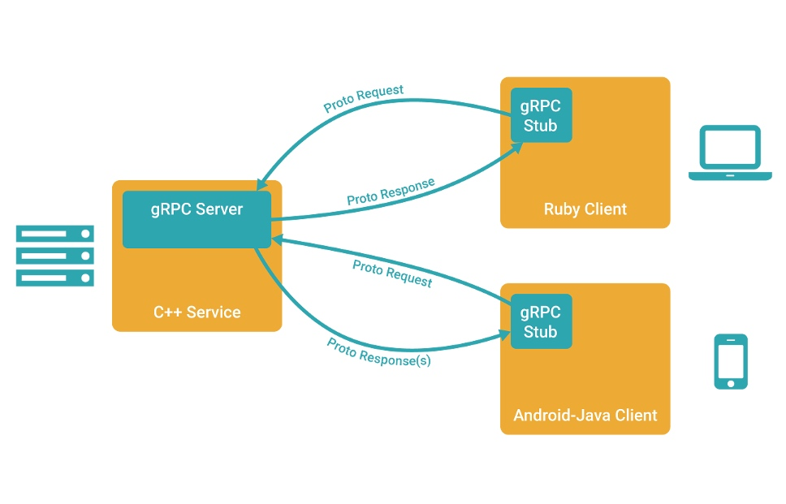
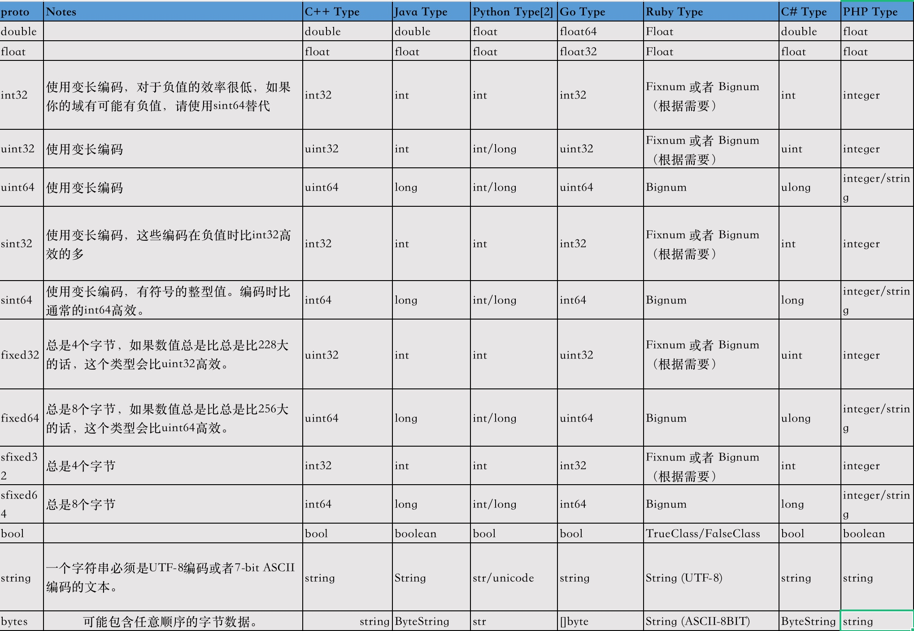

# gRPC
gRPC 一开始由 google 开发，是一款语言中立、平台中立、开源的远程过程调用(RPC)系统。
## 什么是 gRPC？
gRPC（gRPC Remote Procedure Call）是一种高性能、开源的远程过程调用（RPC）框架。它允许分布在不同计算机上的应用程序能够像调用本地方法一样进行通信，从而实现了在分布式系统中进行高效的通信。


### 传统 RPC 与 gRPC 的对比
传统的 RPC 模型使用各种协议和编码方式进行通信，这可能导致跨语言通信困难、性能不佳等问题。与此不同，gRPC 使用 Google 开发的 Protocol Buffers（ProtoBuf）进行数据序列化，同时基于 HTTP/2 协议进行通信，从而提供了更高效的通信方式。

### gRPC 的优势和适用场景
* 高性能： gRPC 使用二进制的 ProtoBuf 编码和 HTTP/2 多路复用等技术，从而实现低延迟和高吞吐量的通信。
* 多语言支持： gRPC 支持多种编程语言，包括 Java、Python、Go 等，使得不同团队可以选择自己擅长的语言进行开发。
* 强类型： 使用 ProtoBuf 定义消息和接口，消除了手动解析数据的麻烦。
* 双向流式通信： gRPC 支持双向流式数据传输，适用于实时性要求高的场景。
* 自动代码生成： 根据定义的服务接口和消息，gRPC 可以自动生成客户端和服务端代码，简化开发流程。
### gRPC 在分布式系统中的应用场景
* 微服务通信： gRPC 适用于微服务架构中各个服务之间的通信，能够有效减少通信开销。
* 跨数据中心通信： gRPC 的性能优势使其适用于跨多个数据中心进行通信，提供更好的用户体验。
* 实时通信： 借助双向流式通信，gRPC 适合实时通信场景，如聊天应用和实时数据推送。
* 通过了解 gRPC 的基本概念、与传统 RPC 的不同之处以及它在分布式系统中的优势，你将能够更好地理解为什么 gRPC 是一个值得学习和应用的强大工具。

## proto文件
```
// 使用proto3语法
syntax = "proto3";

// 指定生成的go代码的包名【. 表示当前目录, 也可以指定绝对路径; service 表示包名】
option go_package = ".;service";

// 定义服务
service TestHello {
  rpc TestHello(HelloRequest) returns (HelloResponse);
}

// 定义请求
message HelloRequest {
  string name = 1;
  int64 age = 2;
}

// 定义响应
message HelloResponse {
  string message = 1;
}
```
## 嵌套类型
```
syntax = "proto3";

package com.lglbc.hello;

message NestedProto {
  string name = 1;
  ChildProto child = 2;
  message ChildProto {
    string name = 1;
  }
}
```
## 集合类型
```
syntax = "proto3";

package com.lglbc.hello;

message RepeatProto {
  repeated string name = 1;
  repeated ChildProto child = 2;
}
message ChildProto {
  string name = 1;
}
```
## 枚举类型
```
syntax = "proto3";

package com.lglbc.hello;

message EnumsProto {
  string use_string=1;
  Enums enums = 2;
  enum Enums {
    STATUS_OFF = 0;
    STATUS_ON = 1;
  }
}
```
## 导入其它proto
```
syntax = "proto3";
import "simple.proto";
package com.lglbc.hello;

message ImportProto {
  SimpleProto simple=1;
}
```
## Map类型
```
syntax = "proto3";

package com.lglbc.hello;

message MapProto {
  map<sint32,sint32> map_int=1;
  map<string,sint32> map_str=2;
//  map<float,sint32> map_float=3;
//  map<bytes,sint32> map_double=4;
}
```
## 各语言类型映射


## 认证传输

# SSL/TLS认证

1. key: 服务器上的私钥文件，用于对发送给客户端数据加密，以及对客户端接收到数据解密
2. csr：证书签名请求文件，用于提交给证书颁发机构（ca）对证书签名
3. crt: 由证书颁发机构（ca）签名后生成的证书文件
4. pem: 证书文件

1. 生成证书
```
# 1、生成密钥
openssl genrsa -out server.key 2048

# 2、生成证书请求文件
openssl req -new -x509 -key server.key -out server.crt -days 36500

# 3、生成csr文件对应的证书
openssl req -new -key server.key -out server.csr

# 4、生成证书私钥
openssl genpkey -algorithm RSA -out test.key

# 5、通过私钥test.key 生成证书请求文件test.csr
openssl req -new -nodes -key test.key -out test.csr -days 36500 -subj "/C=CN/ST=Beijing/L=Beijing/O=Test/OU=Test/CN=test.com" -config ./openssl.cfg -extensions v3_req

# 6、生成SAN证书 pem
openssl x509 -req -days 36500 -in test.csr -out test.pem -CA server.crt -CAkey server.key -CAcreateserial -extfile ./openssl.cfg -extensions v3_req
```